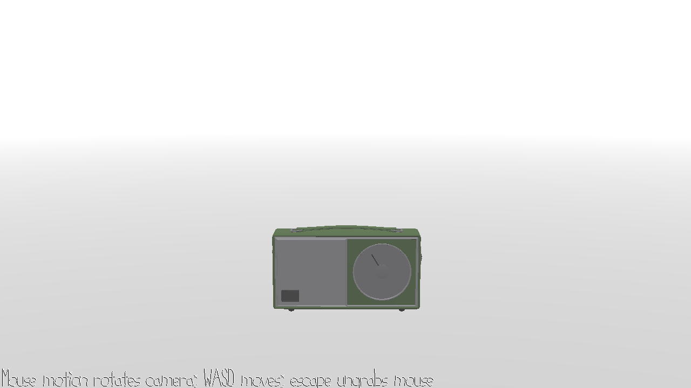

# Cold Music

Author: Hao Chen

Design: Pick up radios playing music in the endless blizzard where you got lost. The night is coming, maybe only music can lead you home.

Screen Shot:

How To Play:

- A FPS style camera is implemented which you may be familiar with. Mouse controls view and WASD controls move.
- Find the radios nearby. At first you can see them, but when the blizzard becomes harsher and the sky gets darker, the music may be the only way you can find them.

Sources:
- [Vintage AM Radio Sony SR-22](https://blendswap.com/blend/24569) is created by [5thElement](https://blendswap.com/profile/375909) under CC-0 license.
- Following sound effects are from ALEXANDER under CC BY-NC 4.0.
  - [Footsteps in Snow Sound Effect](https://orangefreesounds.com/footsteps-in-snow-sound-effect/)
  - [Blizzard Sound Effect](https://orangefreesounds.com/blizzard-sound-effect/)
- [Pick up down phone sound effect](http://www.freesoundslibrary.com) comes from freesounds library under CC BY 4.0.
- [Shivering sound](https://freesound.org/people/AryaNotStark/sounds/407633/) comes from AryaNotStark under CC BY-NC 3.0 license. It is a clip of the original work.
- Following musics are from [Silu Wang](https://bi.bi/) under CC BY-NC 4.0. No modification has been made to the contents of those work.  
[This page](https://bi.bi/download/) lists all resource links of them.
  - Comptine d’un autre été : L’Après-Midi

This game was built with [NEST](NEST.md).

